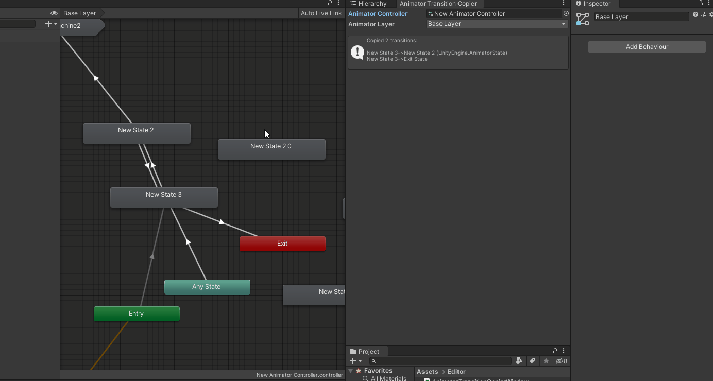

# Unity-AnimatorTransitionCopier
AnimatorTransitionCopier is a simple tool to **copy paste animation transitions** in Animator editor.

It helps you to depart from suffering when you have to change animation states in a huge state machine, such as from clip to blend tree.

## Features
- [x] It copys full infomation, including transition settings and conditions.
    * It holds the order of the transitions in state as well.
- [x] Two ways to copy:
    1. Selected transitions
    2. Ingoing/Outgoing transitions of selected state 
- [x] It supports undo/redo as well.
- [x] It supports AnyState, EntryState, and ExitState.
- [x] It supports multiple selection for pasting. (Contributed by @sungnyung)
- [ ] It supports transitions between StateMachine and State. (yet)

## Preview
### Copy selected transitions

### Copy all transitions of selected state

### AnyState, EntryState, and ExitState

## Usage
1. Import `Assets/Editor` folder into your project.
2. Open window from menu: Custom > AnimationTools > Animator Transition Copier.
3. Assign the AnimatorController and AnimatorLayer which you want to mainpulate and enjoy it.

*Notice that the tool window does not refresh immediately, it only refreshs when your mouse is on it.*

## Classes
* [AnimatorTransitionCopierWindow.cs](./Assets/Editor/AnimatorTransitionCopierWindow.cs) - Main class.
* [EditorGUIHelper.cs](./Assets/Editor/EditorGUIHelper.cs) - A part of my helper library. It provides useful EditorGUI and GUILayout extensions.

## Issues & Warnings
### Can it copy transitions between state machine and state??
**NO, IT CAN'T.** 

Although I've tried to implement this feature, it seems impossible to get the outgoing transitions from [AnimatorStateMachine](https://docs.unity3d.com/ScriptReference/Animations.AnimatorStateMachine.html). If someone can teach me how to get them, I'll make it.

### Pasting AnyState and EntryState seems broken?
**NO, IT WORKS**

It's kind of a Unity bug that the editor doesn't refresh immediately when you paste the transitions of entry or any state in non-first state machine.

But it actually works, just a UI bug. 

Example:

## Environment
Unity 2019.4.17f1 LTS
