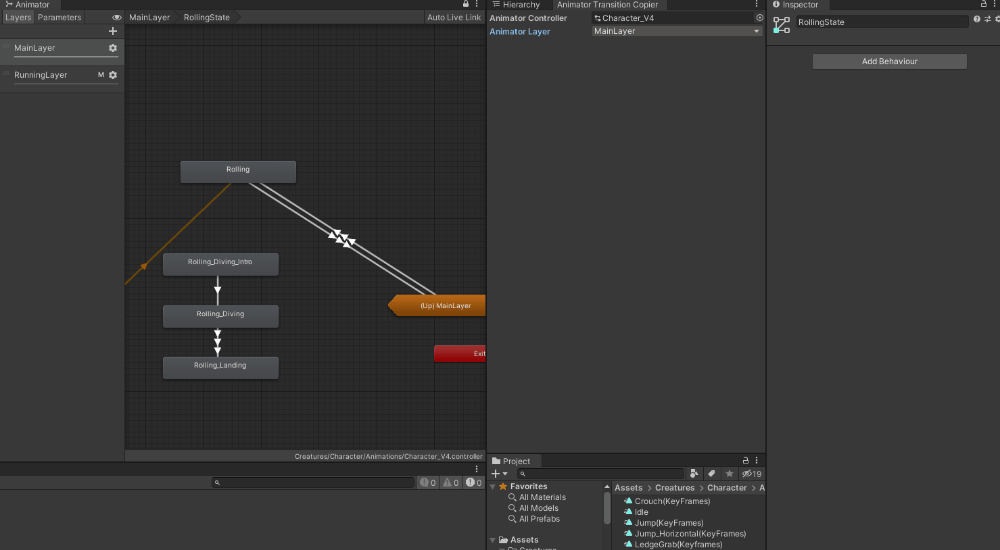
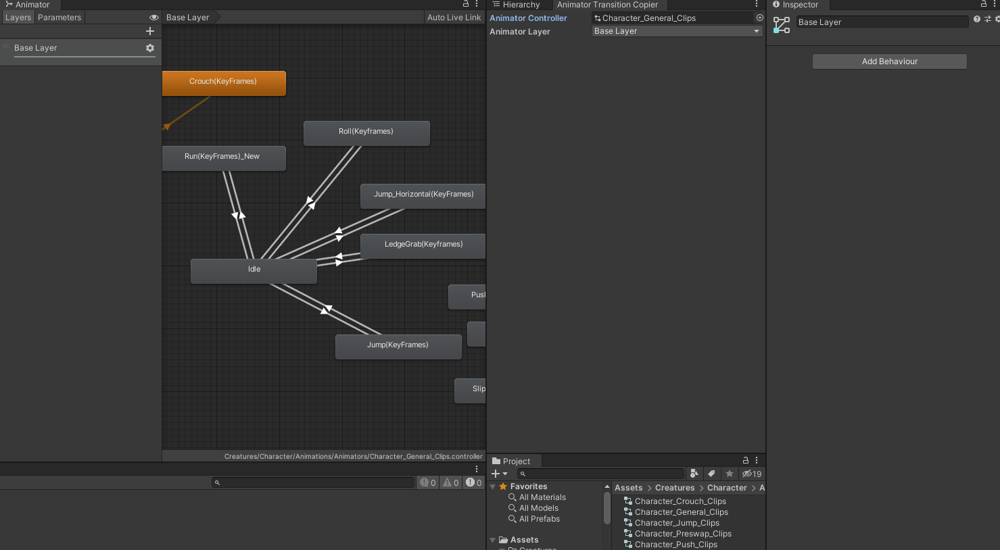
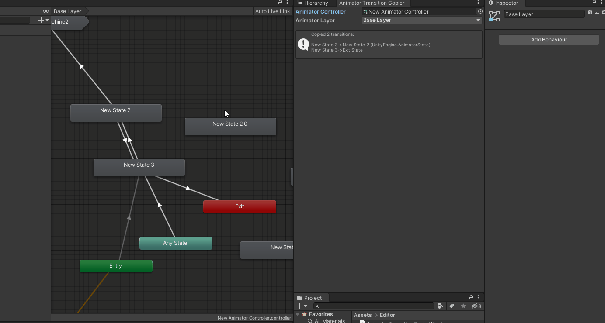
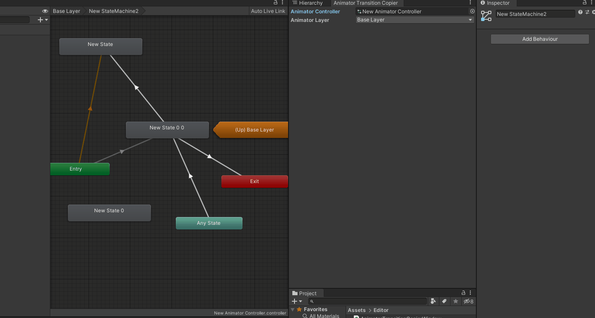

# Unity-AnimatorTransitionCopier
AnimatorTransitionCopier is a simple tool for **copying and pasting animation transitions** in the Animator editor.

It can help alleviate the frustration of having to manually redo all the animation states in a large state machine when making changes, such as switching from a clip to a blend tree.

- [Features](#features)
- [Preview](#preview)
  - [Copy selected transitions](#copy-selected-transitions)
  - [Copy all transitions of selected state](#copy-all-transitions-of-selected-state)
  - [AnyState, EntryState, and ExitState](#anystate-entrystate-and-exitstate)
- [Getting Started](#getting-started)
  - [Install via UPM git URL package.](#install-via-upm-git-url-package)
  - [Open the tool in Unity.](#open-the-tool-in-unity)
- [FAQ](#faq)
    - [Can it copy transitions between state machine and state??](#can-it-copy-transitions-between-state-machine-and-state)
    - [Pasting AnyState and EntryState seems broken?](#pasting-anystate-and-entrystate-seems-broken)
  - [Environment](#environment)
  - [Classes](#classes)


## Features
- [x] It copys full infomation, including transition settings and conditions.
    * It holds the order of the transitions in state as well.
- [x] Two ways to copy:
    1. Selected transitions
    2. Ingoing/Outgoing transitions of selected state 
- [x] It supports undo/redo as well.
- [x] It supports AnyState, EntryState, and ExitState.
- [x] It supports multiple selection for pasting. (Contributed by [@sungnyung](https://github.com/sungnyung) and [@kwbn64](https://github.com/kwbn64) [#1](https://github.com/qwe321qwe321qwe321/Unity-AnimatorTransitionCopier/pull/1))
- [x] It supports transitions between StateMachine and State.
   - [x] Copy selected transitions that go from a State to a StateMachine.  (Contributed by [@Eyellen](https://github.com/Eyellen) [#3](https://github.com/qwe321qwe321qwe321/Unity-AnimatorTransitionCopier/pull/3))
   - [x] Copy outgoing transitions that go from a State to a StateMachine. ([#4](https://github.com/qwe321qwe321qwe321/Unity-AnimatorTransitionCopier/pull/4))
   - [x] Copy selected transitions that go from a StateMachine to a State. ([#4](https://github.com/qwe321qwe321qwe321/Unity-AnimatorTransitionCopier/pull/4))
   - [x] Copy ingoing transitions that go from a StateMachine to a State. ([#4](https://github.com/qwe321qwe321qwe321/Unity-AnimatorTransitionCopier/pull/4))
   - [x] Copy selected transitions that go from a StateMachine to a StateMachine. ([#4](https://github.com/qwe321qwe321qwe321/Unity-AnimatorTransitionCopier/pull/4))
   - [x] Copy outgoing transitions that go from a StateMachine to a StateMachine. ([#4](https://github.com/qwe321qwe321qwe321/Unity-AnimatorTransitionCopier/pull/4))
   - [x] Copy ingoing transitions that go from a StateMachine to a StateMachine. ([#4](https://github.com/qwe321qwe321qwe321/Unity-AnimatorTransitionCopier/pull/4))

## Preview
### Copy selected transitions


### Copy all transitions of selected state


### AnyState, EntryState, and ExitState


> Notice that the tool window does not refresh immediately, it only refreshes when your mouse is on it.

## Getting Started 
### Install via UPM git URL package.
* [Install a package from a Git URL](https://docs.unity3d.com/Manual/upm-ui-giturl.html)
* Git URL:
```
https://github.com/qwe321qwe321qwe321/Unity-AnimatorTransitionCopier.git?path=Assets/com.pedev.unity-animator-transition-copier
```

or asset package availiable in [releases](https://github.com/qwe321qwe321qwe321/Unity-AnimatorTransitionCopier/releases).

### Open the tool in Unity.
* It is in the menu `Custom\AnimationTools\AnimatorTransitionCopier`
* Put the Animator Controller file that you are editing into the field.


## FAQ
### Can it copy transitions between state machine and state??
**YES** 

We solved this issue on [#3](https://github.com/qwe321qwe321qwe321/Unity-AnimatorTransitionCopier/pull/4), 
[#4](https://github.com/qwe321qwe321qwe321/Unity-AnimatorTransitionCopier/pull/4).

### Pasting AnyState and EntryState seems broken?
**NO, IT WORKS**

It's kind of a Unity bug that the editor doesn't refresh immediately when you paste the transitions of entry or any state in non-first state machine.

But it actually works, just a UI bug. 


## Environment
Unity 2019.4.17f1 LTS


## Classes
* [AnimatorTransitionCopierWindow.cs](./Assets/com.pedev.unity-animator-transition-copier/Editor/AnimatorTransitionCopierWindow.cs) - Main class.
* [EditorGUIHelper.cs](./Assets/com.pedev.unity-animator-transition-copier/Editor/EditorGUIHelper.cs) - A part of my helper library. It provides useful EditorGUI and GUILayout extensions.
